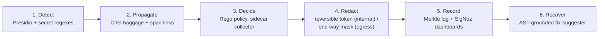
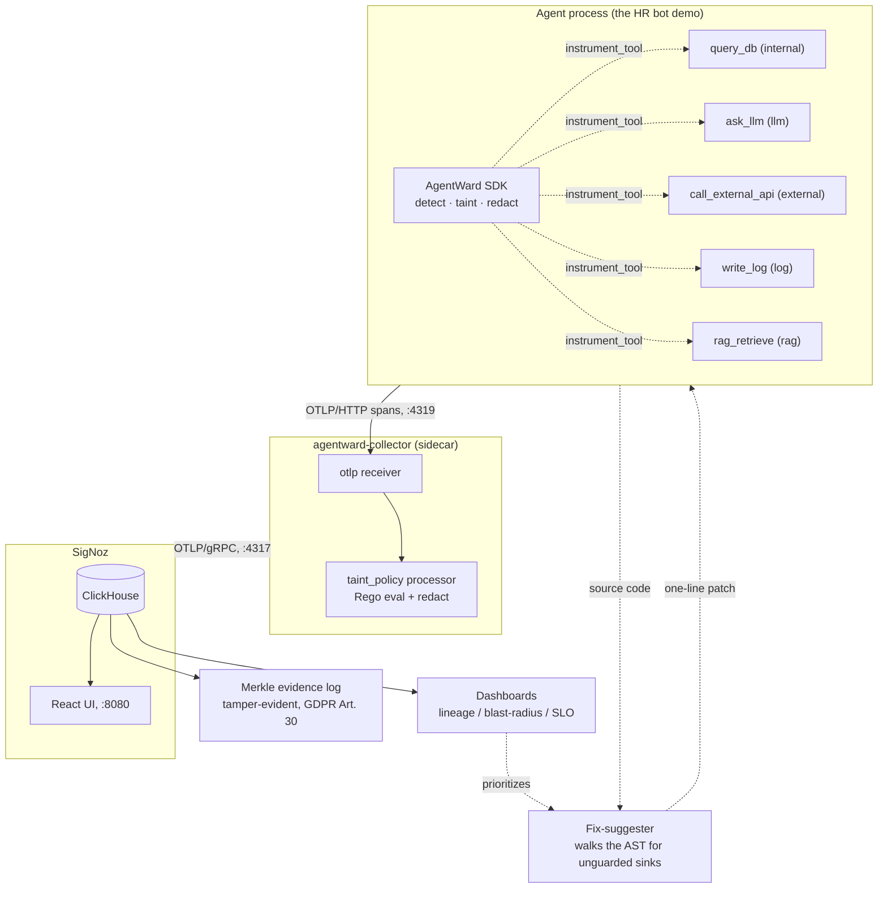

# AgentWard

> A GPS tracker for sensitive data inside AI agents: runtime **enforcement** of
> the Data Over-Exposure (DOE) model on OpenTelemetry + SigNoz.

## The problem

AI agents chain tool calls together: read from a database, hand the result to
an LLM, call an external API, write a log line. Somewhere in that chain, a
field that should never have left the building (an SSN, an API key, a
customer's address) can slip through, because nobody is tracking where the
data actually *goes* once it enters the chain.

[AgentRaft](https://arxiv.org/abs/2603.07557) (Lin et al., March 2026) proved
this is measurable: it found this kind of over-exposure in 57% of the call
chains it analyzed. But AgentRaft is a research pipeline, not something you
can run in production. It works offline, on a custom trace format from the
AgentDojo benchmark, and it decides "was this data strictly necessary?" by
polling three different LLMs and taking a majority vote.

AgentWard takes AgentRaft's formal model and turns it into something that
runs live, on infrastructure you already have (OpenTelemetry + SigNoz), with
no LLM in the hot path:

| AgentRaft | AgentWard |
|---|---|
| Φ = LLM-judged semantic dependency (taint propagation) | structural OTel **baggage + span-link** propagation, real-time and LLM-free |
| D_nec = GPT-4.1 / Qwen3-Plus / DeepSeek-V3.2 voting committee | deterministic **Rego** policy, auditable, no 3 LLM calls per step |
| AgentDojo custom trace format | standard OTel `gen_ai.*` semconv into **SigNoz** |
| offline **detection** | runtime **enforcement** (redact-before-egress) |
| metrics | **lineage / blast-radius** as GDPR Art. 30 evidence |

The underlying math (`D_OE = (D_trans \ (D_nec ∪ D_int)) ∩ D_total`) is kept
exactly as AgentRaft defined it, see [`core/doe.py`](core/doe.py) and
[`docs/agentraft-mapping.md`](docs/agentraft-mapping.md) for the full
section-by-section mapping. The build plan is in [`PLAN.md`](PLAN.md).

## How it works

Six stages, each replacing one piece of AgentRaft with something that runs
in real time:



And here is the actual runtime shape of it, an agent process instrumented
with the AgentWard SDK, talking to a sidecar collector that makes the
policy decision before anything reaches storage:



Two propagation layers do the actual tracking, which is the part that has
to survive an LLM rewriting the data beyond recognition:

1. **Chain-level (baggage)**: the moment a tool call touches sensitive data,
   a compact tag (`taint.id`, `taint.classes`, never the value itself) rides
   along in OTel baggage to every downstream span in that trace. This
   doesn't care what the LLM does to the data. Even if summarizing or
   translating destroys the original bytes, the taint tag survives because
   it's attached to the *call chain*, not the *value*.
2. **Field-level (re-detection)**: every tool's input and output is
   re-scanned on the way through, so brand-new sensitive data introduced
   mid-chain (an LLM inventing a plausible-looking SSN, say) still gets
   caught.

At the sink, the collector's Rego policy is what actually decides:
`sensitive data + destination in {external, llm, log} ⇒ violation`, plus a
second rule for cross-border transfers (`PII + non-adequate jurisdiction ⇒
transfer_violation`, the GDPR Art. 44 case). Whatever the policy flags gets
redacted before it's ever written to SigNoz's storage.

## See it in action

Running the breach simulator (injects a fake SSN and AWS key into the HR
bot's database, then lets the agent's normal `query_db → internal_store →
ask_llm → rag_retrieve → call_external_api → write_log` chain run) produces
this, verified against a live SigNoz instance:

| tool | destination | stored value | violation | transfer |
|---|---|---|---|---|
| `query_db` | internal | `"ssn": "[PII]"` | no | no |
| `internal_store` | internal | `"ssn": "103-48-0677"` (reversible token, same shape as a real SSN, round-trips to the original) | no | no |
| `ask_llm` | llm | `"ssn": "[PII]"` | **yes** | **yes** |
| `rag_retrieve` | rag | `[PII]` (embeddings are invertible, so RAG is treated as egress too) | no | no |
| `call_external_api` | external | `[PII]` | **yes** | **yes** |
| `write_log` | log | `[PII]` | **yes** | no |

The real SSN and the real AWS key never appear anywhere in ClickHouse, not
even in the spans for tools that legitimately need the data internally.
That's the "context-aware" part: the same field gets a reversible token in
one tool and an irreversible mask two hops later, because the system tracked
*where the data was actually headed*, not just what field it came from.

## Status

All six phases are built and verified, each landed as its own stacked PR:

| phase | does | replaces |
|---|---|---|
| 1 | formal DOE model + local SigNoz substrate | (foundation) |
| 2 | runtime taint on OTel (baggage + per-I/O re-detection) | AgentRaft's Φ (LLM-judged propagation) |
| 3 | Rego policy in a sidecar collector | AgentRaft's D_nec 3-LLM committee |
| 4 | reversible, context-aware redaction (FF3 FPE for internal, mask for egress) | static field-name masking |
| 5 | tamper-evident Merkle log + lineage / blast-radius / SLO dashboards | metrics turned into verifiable Art. 30/15 records |
| 6 | AST-grounded fix-suggester + DLP dry-run | (AgentRaft has no recovery step) |

45 Python tests + 3 Go tests, all green. Per-phase writeups live in
`docs/phase{3,4,5,6}-*.md` and `docs/spike-llm-hop.md`.

## Run it yourself

```bash
# unit tests, no SigNoz needed
python3 -m unittest discover tests        # 45 Python tests
cd collector/processor/taintpolicy && go test ./...   # 3 Go processor tests

# end-to-end (needs SigNoz + the sidecar collector up)
cd signoz && foundryctl cast -f casting.yaml                              # start SigNoz
cd collector && ./bin/agentward-collector --config file:./config.yaml &  # sidecar, :4319
python3 demo/hr_bot/breach_simulator.py --endpoint http://localhost:4319/v1/traces
python3 demo/phase5_evidence_demo.py                    # Merkle inclusion + tamper check
python3 fix_suggester/suggest.py fix_suggester/sample_buggy_agent.py
```

Then open `http://localhost:8080`, filter on `agentward.violation=true`, and
you'll see the flagged spans from the run above.

⚠️ The Phase 4 redaction uses **FF3** (NIST withdrew it in Feb 2025; the
`FPE` FF1 package failed to build here) plus an in-process vault, so treat
it as demo-grade. In production, swap to FF1 via HashiCorp Vault Transform
and a managed key.

## Layout

```
core/           formal DOE model (pure, the mathematical anchor)
sdk/            Python: detect / taint / redact / instrumentation   (Phase 2+)
collector/      Go: custom OTel processor + Rego policy             (Phase 3+)
demo/hr_bot/    the instrumented demo bot + breach simulator
dashboards/     SigNoz JSON: lineage / blast-radius / SLO / alerts
fix_suggester/  AST-walk patch proposer                             (Phase 6)
evidence/       tamper-evident Merkle log (Art. 30 evidence)        (Phase 5)
tests/          unit + e2e
```

## References

- AgentRaft: Automated Detection of Data Over-Exposure in LLM Agents, Lin et al.,
  arXiv:2603.07557, March 2026.
- OpenTelemetry GenAI semantic conventions (`gen_ai.*`).
- SigNoz, OTel-native observability.
